# Tracky

**Tracky** is a delivery tracking system prototype built for academic purposes as part of the Laboratory for Mobile and Distributed Application Development course at PUC Minas University. This project demonstrates modern software architecture principles, microservices design, and cross-platform mobile development.

## About the Project

Tracky is a delivery management system that connects customers who need packages delivered with drivers who can fulfill those deliveries. The system provides real-time tracking, route optimization, automated notifications, and a mobile experience for both user types.

### Key Features

- **Customer Experience**: Create orders, track deliveries in real-time, receive notifications, and manage delivery preferences
- **Driver Experience**: Accept orders, update delivery status, optimize routes, and manage driver profiles
- **Real-time Tracking**: Live location updates with interactive maps and route visualization
- **Smart Notifications**: Push notifications and email alerts for order status changes
- **Marketing Campaigns**: Simple campaign management for promotions and customer engagement

### Technology Stack

#### Backend (Microservices Architecture)

- **Java 17** with **Spring Boot** framework
- **HashiCorp Consul** for service discovery and configuration
- **RabbitMQ** for asynchronous messaging between services
- **Docker** and **Docker Compose** for containerization
- **Maven** for dependency management and build automation
- **JWT** for secure authentication
- **Google Maps API** for route calculation and optimization
- **Firebase Cloud Messaging** for push notifications
- **SMTP** for email notifications

#### Mobile Application (Cross-platform)

- **Flutter** framework with **Dart** programming language
- **Provider** for state management
- **Google Maps** integration for interactive mapping
- **Geolocator** for real-time location services

### Architecture

The system follows a **microservices architecture** with service discovery, providing scalability and maintainability:

The backend consists of specialized services:

- **API Gateway**: Single entry point routing requests to appropriate services
- **User Service**: Authentication and user management
- **Order Service**: Order creation and lifecycle management
- **Tracking Service**: Real-time location tracking and updates
- **Campaign Service**: Marketing campaign management and execution
- **Notification Service**: Event-driven push and email notifications

### Academic Purpose

This project was developed as an **educational assignment** to demonstrate:

- Modern microservices architecture design
- Cross-platform mobile development with Flutter
- Service discovery and distributed systems concepts
- Real-time data synchronization and messaging
- Integration with third-party APIs and services
- Docker containerization and deployment strategies

## Team Members

- Fernando Ibrahim ([@FernandoIbrahim](https://github.com/FernandoIbrahim))
- Jhonata Dias ([@jhonatasdias](https://github.com/jhonatasdias))
- Pedro Braga ([@bragap](https://github.com/bragap))
- Luca Azalim ([@lucaazalim](https://github.com/lucaazalim))

## Getting Started

For detailed setup instructions, please refer to:

- **Backend Setup**: [Backend README](code/backend/README.md) - Complete guide for running the microservices
- **Mobile Setup**: [Mobile README](code/mobile/README.md) - Flutter app installation and configuration

## Demo Video

## Screenshots

|               **Login/Register screen**                |                **Customer orders list**                |
| :----------------------------------------------------: | :----------------------------------------------------: |
|  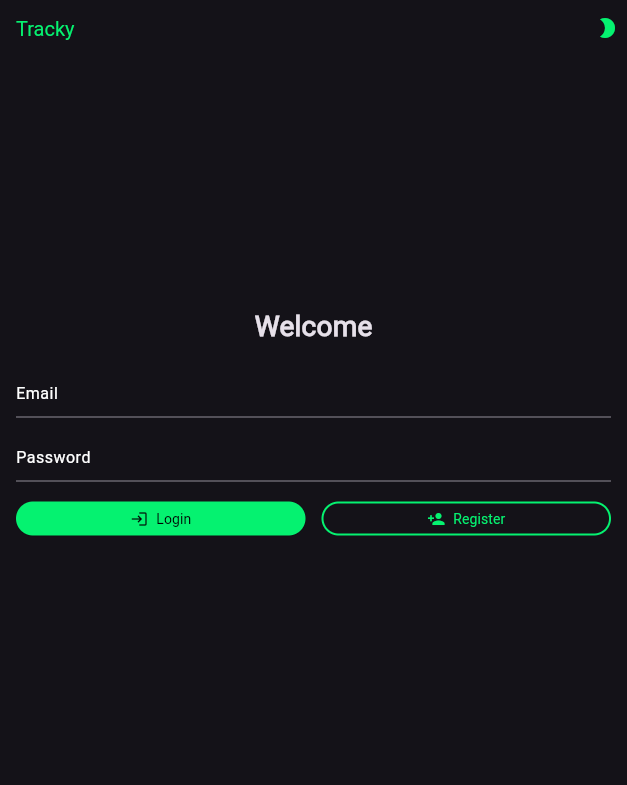  |  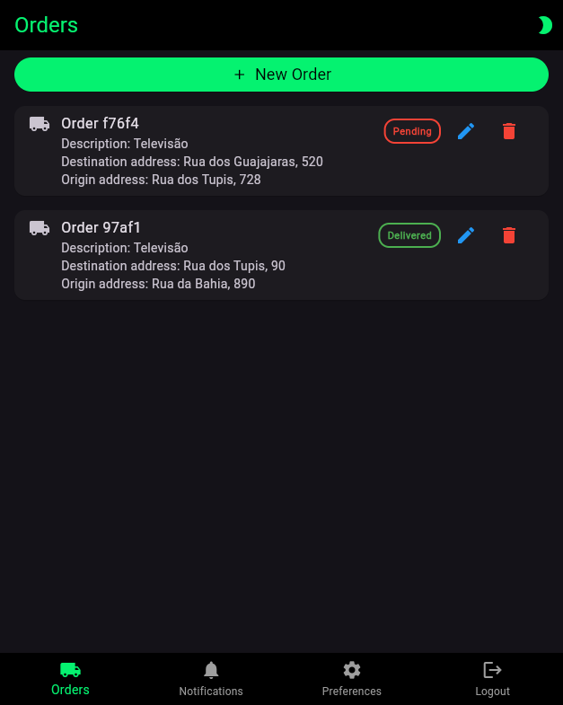  |
|                  **Create new order**                  |                **Edit existing order**                 |
|  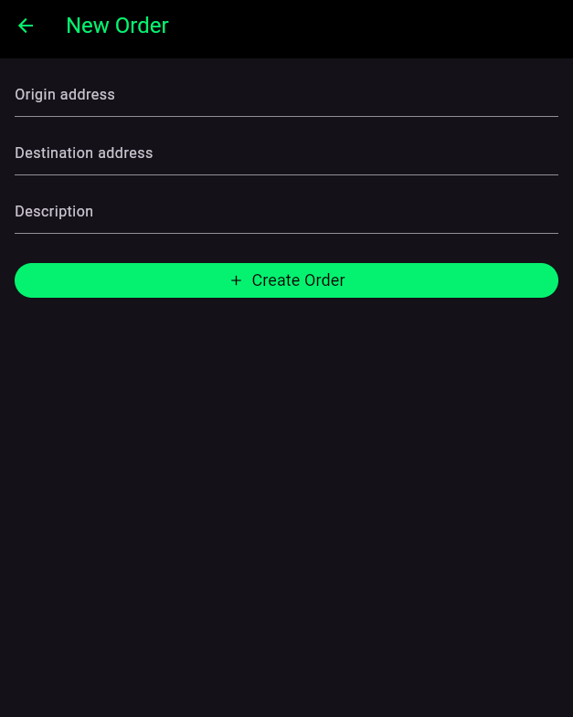  |  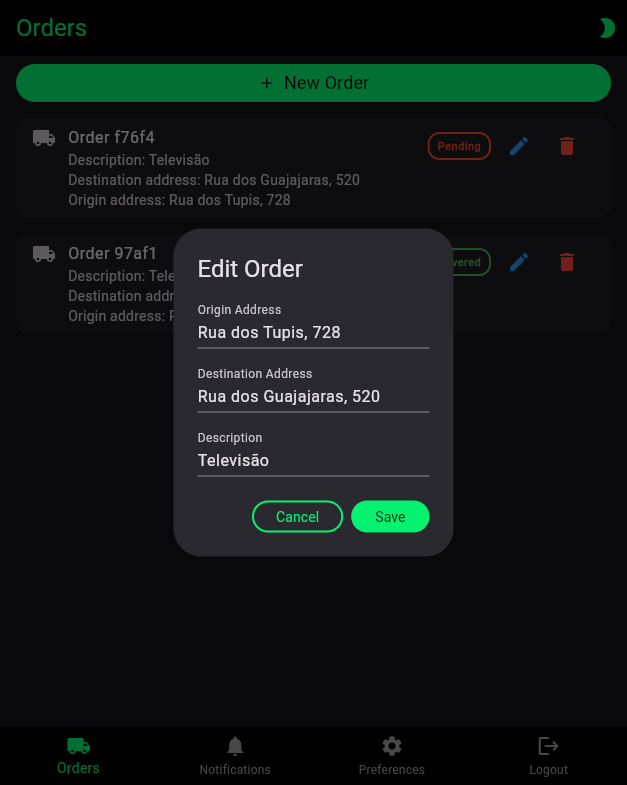  |
|                **Delete confirmation**                 |               **Order details with map**               |
|  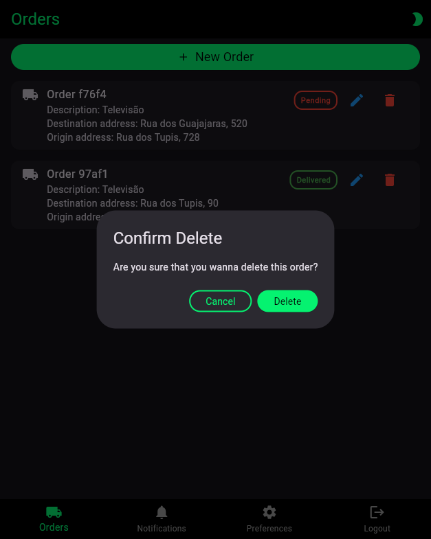  |  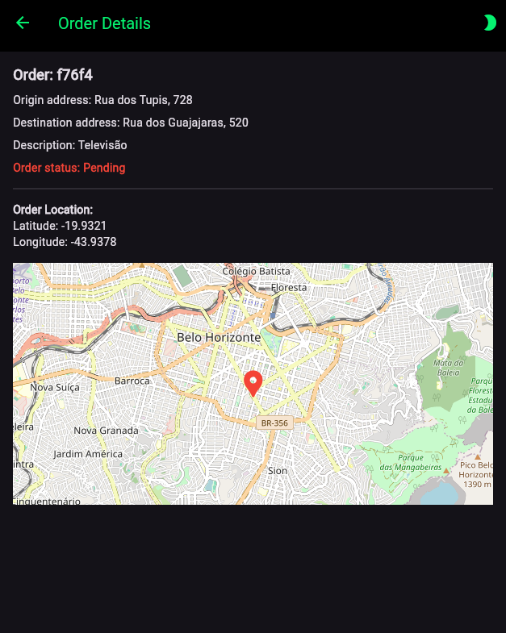  |
|                   **Notifications**                    |                 **Preferences screen**                 |
|    |  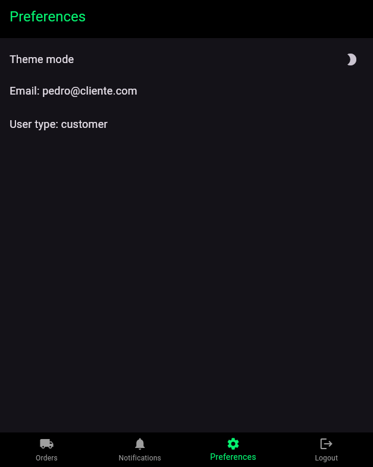  |
|         **List of assigned/available orders**          |     **Order details (with "Accept order" button)**     |
|  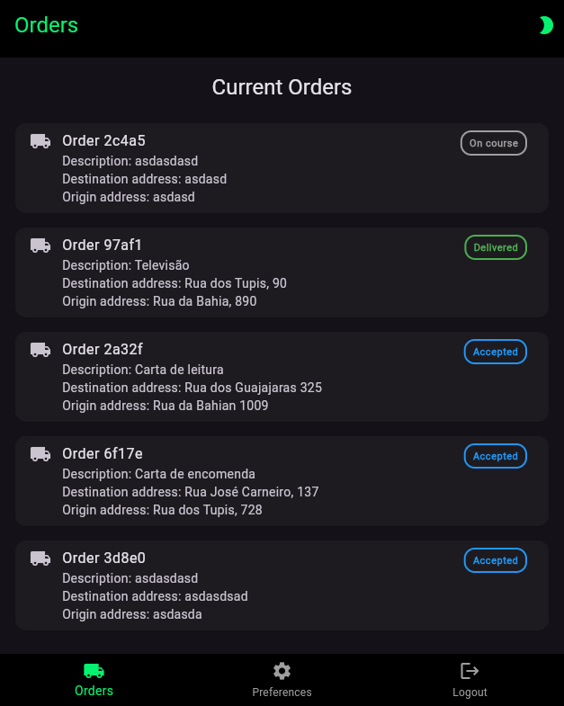  | 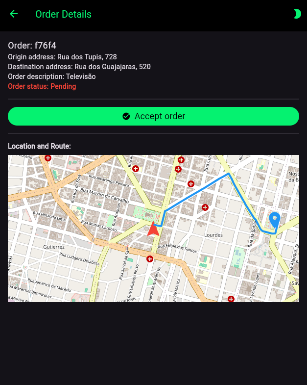 |
|                **Change order status**                 |       **Order details with full delivery route**       |
| 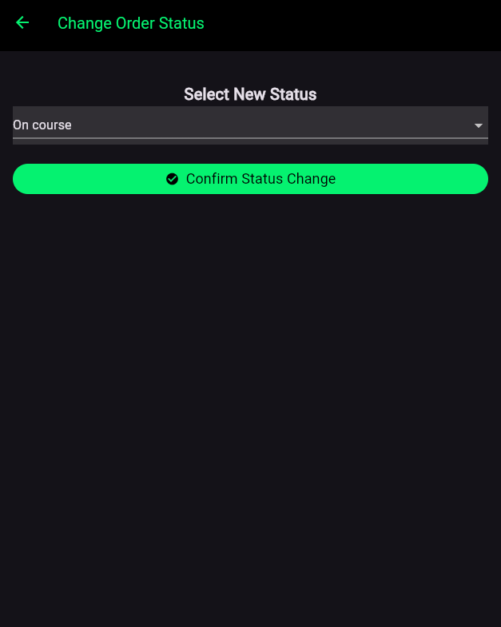 | 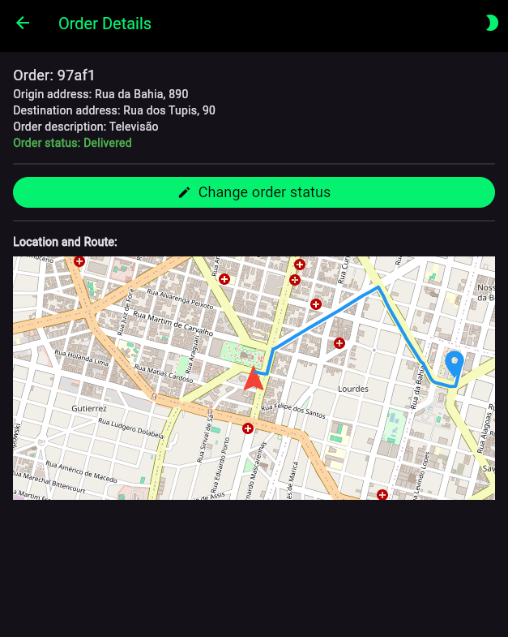 |
