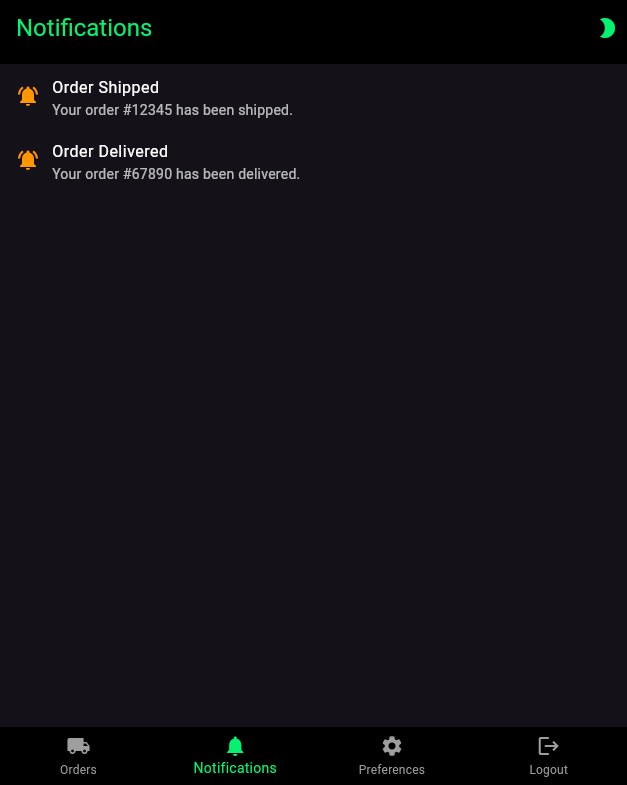

# Tracky

This project was developed as an assignment for the Laboratory for Mobile and Distributed Application Development course at PUC Minas University by:

- Fernando Ibrahim ([@FernandoIbrahim](https://github.com/FernandoIbrahim))
- Jhonata Dias ([@jhonatasdias](https://github.com/jhonatasdias))
- Pedro Braga ([@bragap](https://github.com/bragap))
- Luca Azalim ([@lucaazalim](https://github.com/lucaazalim))

<h2>Demo video</h2>

## Screenshots

|               **Login/Register screen**                |                **Customer orders list**                |
| :----------------------------------------------------: | :----------------------------------------------------: |
|    |    |
|                  **Create new order**                  |                **Edit existing order**                 |
|    |    |
|                **Delete confirmation**                 |               **Order details with map**               |
|    |    |
|                   **Notifications**                    |                 **Preferences screen**                 |
|    |    |
|         **List of assigned/available orders**          |     **Order details (with "Accept order" button)**     |
|    |  |
|                **Change order status**                 |       **Order details with full delivery route**       |
|  |  |
